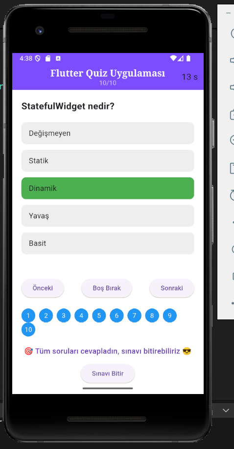
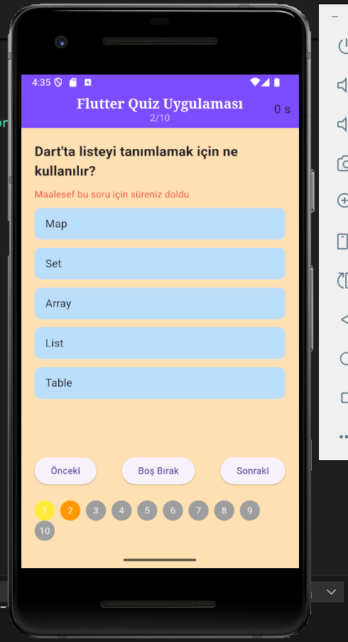
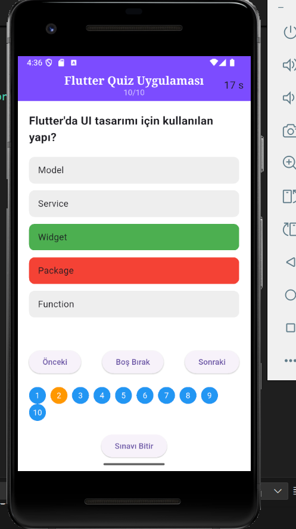
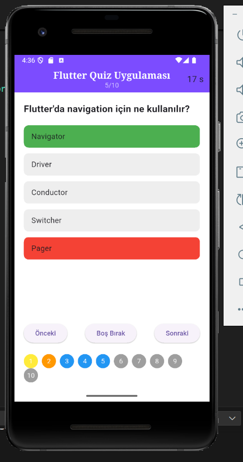
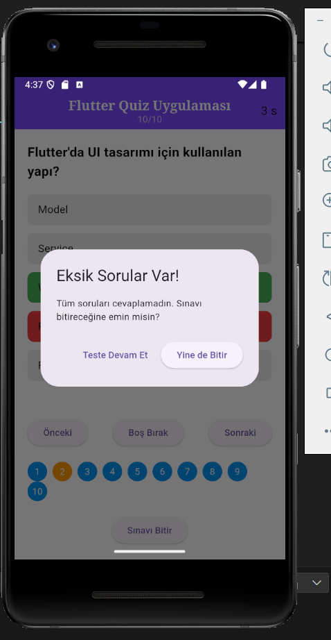
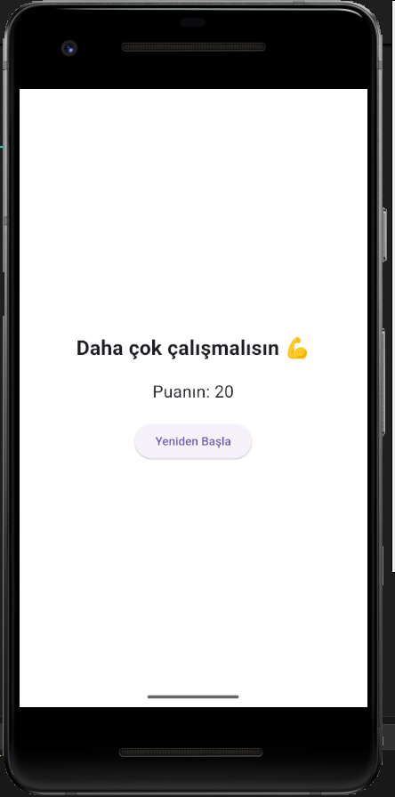
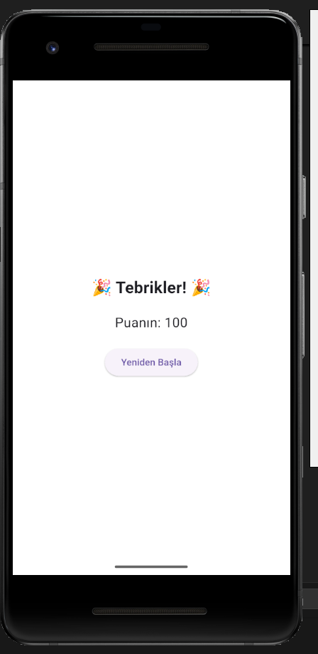

# 📱 Flutter Quiz Uygulaması

Flutter ile geliştirilmiş, zaman sınırlı sorulardan oluşan interaktif bir quiz (sınav) uygulamasıdır. Uygulama 10 sorudan oluşur ve her sorunun farklı durumlara göre kullanıcıya özel görsel geri bildirimleri vardır.

## ✨ Özellikler

- ⏱ Her soru için 20 saniyelik zaman sınırlaması
- 🔁 Geri-ileri navigasyon
- ❔ "Boş Bırak" özelliği
- 🟦 Cevaplanan sorular **mavi**  
- 🟨 Boş bırakılan sorular **sarı**  
- 🟧 Süresi dolan sorular **turuncu**  
- ✅ Doğru cevap **yeşil**, ❌ yanlış cevap **kırmızı**
- 🎯 10. soruda **"Sınavı Bitir"** butonu
- ⚠ Eksik sorularda uyarı ekranı
- 🧮 Her doğru cevap 10 puan
- 🔁 Sınavı yeniden başlatma imkanı
- 🏁 Sonuç ekranında puana göre mesaj:
  - **< 70:** "Daha çok çalışmalısın 💪"
  - **≥ 70:** "🎉 Tebrikler! 🎉"

---

## 🖼 Uygulama Ekran Görüntüleri

### 🔹 Soru Ekranı
Kullanıcıların bir soruyu normal şekilde cevapladığı ekran görünümü.



---

### ⏳ Süre Doldu
20 saniyelik süre dolduğunda ekran turuncuya döner ve uyarı gösterilir.



---

### ✅ Doğru ve ❌ Yanlış Cevap
Doğru cevap yeşil, yanlış cevap kırmızı olarak gösterilir.



---

### 🧭 Soru Takip Kutucukları
Alt kısımdaki kutucuklar sayesinde her sorunun durumu takip edilebilir.



---

### ⚠️ Eksik Soru Uyarısı
Kullanıcı tüm soruları cevaplamadan sınavı bitirmeye çalışırsa uyarı ekranı çıkar.



---

### 📉 Başarı Yoksa
70 puanın altında kalan kullanıcılar için çalışma teşviki ekranı.



---

### 🎉 Başarı Mesajı
Tüm soruları doğru cevaplayan kullanıcı için tebrik mesajı.



---

## 👨‍💻 Proje Ekibi

- **Kadir IR** – 1220505055
- **Didem Gümüş** – 1220505059  

---

## 🚀 Kurulum

```bash
git clone https://github.com/kullaniciAdi/flutter-quiz-uygulamasi.git
cd flutter-quiz-uygulamasi
flutter pub get
flutter run
